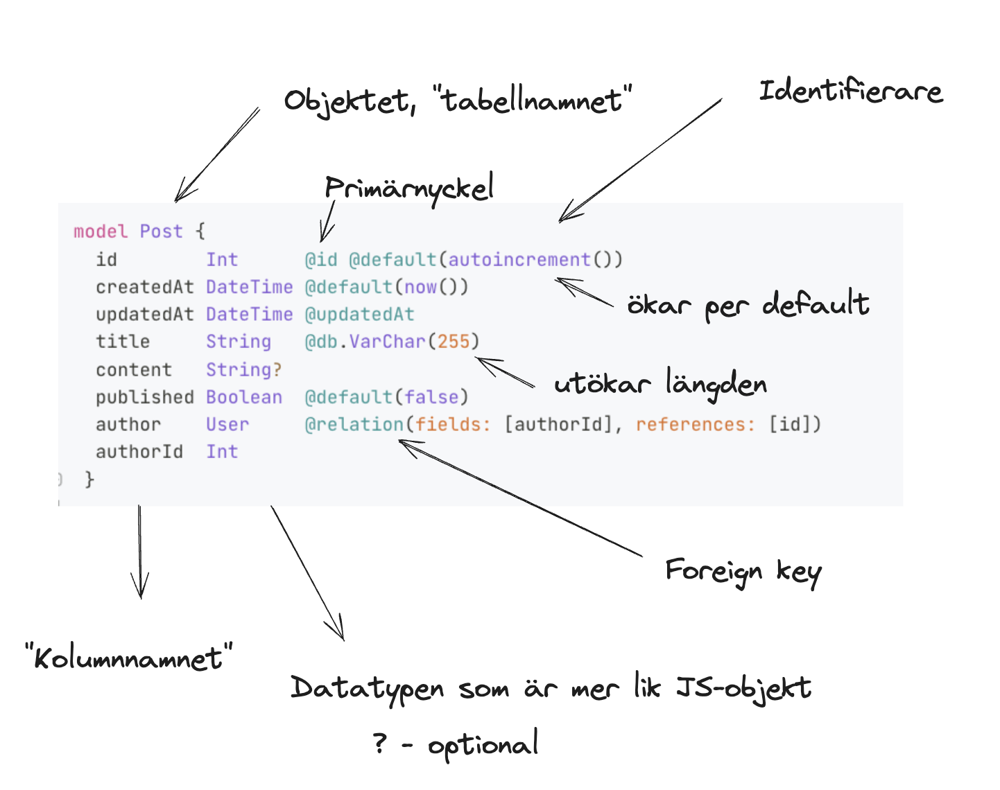

# Backendutveckling och API:er workshop: Skapa REST API med Prisma ORM 

👋 Ta inspiration/struktur från lektion 28 maj och [getting started på prisma.io](https://www.prisma.io/docs/getting-started/setup-prisma/start-from-scratch/relational-databases-typescript-postgresql) ✅ 

### Din uppgift:

Du ska skapa ett REST API för 2 till 3 olika resurser men nu med Prisma ORM som databashanterare. Du fortsätter använda Node.js, Express för att skriva dina routes. Du ska istället för en lokal MySQL-databas använda en PostgreSQL-databas i molnet. En annan skillnad är nu att du ska använda Typescript för din kodbas (vilket passar bra till Prisma)

1. Fortsätt jobba med de resurser du ska använda för [inlämningsuppgiften i kursen](https://chasacademy.instructure.com/courses/289/assignments/1706?module_item_id=8427)

2. Följ [Getting started guiden på prisma.io](https://www.prisma.io/docs/getting-started/setup-prisma/start-from-scratch/relational-databases-typescript-postgresql)

3. Ska npm-projekt ```npm init -y``` 


	Installera dependencies ```typescript ts-node @types/node --save-dev``` 
	samt andra dependencies som hör till node-js/express-backend ```npm install express mysql2   	bcrypt body-parser cors``` samt ```npm i nodemon --save-dev```
	(dotenv för .env-filer sköter Prisma automatiskt)
	
	Eftersom vi nu kör Typescript behöver du nu installera typerna för varje bibliotek, d.v.s
	```@types/node @types/express @types/bcrypt @types/cors```
	
	

4. Initiera typescript med ```npx tsc --init``` och använd denna config i din ```tsconfig.json```

 ```{
  "compilerOptions": {
    "target": "ES6",
    "module": "commonjs",
    "outDir": "./dist",
    "rootDir": "./src",
    "strict": true,
    "esModuleInterop": true
  },
  "include": ["src/**/*"],
  "exclude": ["node_modules"]
}
```

5. Skapa en PostgreSQL-databas på [render.com](https://render.com/). Välj Getting started => New => PostgreSQL o.s.v. Du hämtar databas-urlen under "External Database URL". Denna ska ligga i .env-filen under DATABASE_URL. Kom ihåg att ha en .gitignore som ignorerar .env så att denna INTE pushas till ett repo.
	

6. Intallera och installera Prisma med postgressql som datasource-provider ```npm install prisma --save-dev``` och sedan ```npx prisma init --datasource-provider postgresql```  

7. Börja definera dina modeller (d.v.s istället för tabell) i ```prisma.schema```. Skapa namn, datatyp och om attributet är primärnyckel, har en relation, är unikt eller har ett default-värde. 

8. För att kunna använda din databas utifrån ditt schema så måste du göra en migrering ```npx prisma migrate dev --name init```. Om du någon gång för förändring i ditt schema måste du köra detta kommando igen, fast utan init. Om detta steg lyckas så skapas ditt ```@prisma/client```-paket för att kunna använda Prisma Client API i din applikation

9. Nu kan du börja skriva queries i din databas för dina migrerade modeller! Först måste du installera ```npm install @prisma/client```. Man bör importera Prisma Client endast en gång, använd exempelvis den fil där vi sist skötte databasuppkopplingen till MAMP.

```
// connect.ts
import { PrismaClient } from '@prisma/client'
export const prisma = new PrismaClient()
```

10. Studera i [dokumenationen av på prisma.io](https://www.prisma.io/docs/orm/prisma-client/queries/crud) hur CRUD-operationer fungerar i Prisma, d.v.s create, createMany, findUnique, findMany, update, updateMany, delete, deleteMany. 


11. Använd dig av förra veckans kodbas där vi använde ```mysql2``` och CRUD-operationerna med SQL-syntax. Nu ska du föra över detta till Prisma, d.v.s skriva modeller istället för tabeller, migrera och använda prismafunktionr för CRUD. 

12. Jobba gärna vidare, finslipa dina attribut/types/relation och utöka med fler modeller om du behöver. Försöka att hålla en mappstruktur som är modulär för att utöka resurser. 

13. Testa ditt REST API med ThunderClient eller Postman. Skapa en "collection" för tester av varje resurs så att du enkelt kan testa dina routes


Förslag på mappstruktur:

```
nodejs-mysql-rest-socialmedia
├── .env
├── .gitignore
├── README.md
├── app.js
├── package-lock.json
├── package.json
└── src
    ├── db
    │   └── connect.js
    ├── middleware
    └── resources
        ├── posts
        │   ├── posts.controllers.js
        │   └── posts.routes.js
        └── users
            ├── users.controllers.js
            └── users.routes.js

```


### *Tanken är att du bygger vidare på denna kod nästa vecka och till inlämningsuppgiften!*


# 👩🏽‍💻 Extra

* "Mata" din databas med information som passar ditt Prisma schema. Detta kallas för att "seed:a", så skapa en ```seed.ts``` för engångskörning, [se denna som inspiration](https://github.com/chasacademy-sandra-larsson/workshop-prisma-postgresql/blob/main/seed.ts). Installera och importera Faker från [https://fakerjs.dev/](https://www.prisma.io/docs/orm/prisma-client/queries/filtering-and-sorting) som kan generera fake men realistisk data. 
* Utforska sök-  och filtrering i Prisma exempelvis i findMany-request. Dokumentation: [https://www.prisma.io/docs/orm/prisma-client/queries/filtering-and-sorting
](https://www.prisma.io/docs/orm/prisma-client/queries/filtering-and-sorting)
Här ska du alltså använda query-parametrar!
* Pagination, d.v.s "gå till 100-200 nästa produkter" [https://www.prisma.io/docs/orm/prisma-client/queries/pagination](https://www.prisma.io/docs/orm/prisma-client/queries/pagination)
* Utöka med fler resurser (models). Tänk på databasdesign one-to-one, one-to-many och many-to-many för att skapa ett schema som fungerar att skala upp. Mer om relationella queries: [https://www.prisma.io/docs/orm/prisma-client/queries/relation-queries
](https://www.prisma.io/docs/orm/prisma-client/queries/relation-queries)

# 💬 Diskutera/Bra att kunna

* Vad gör en ORM?
* För att använda CRUD kan MySQL och Postgresql användas utbytbart. Undersök vad det finns för skillnader om man skulle bygga större applikationer.
* Vad menas med att Prisma är "type safe"
* Vad är ett REST API?
* Vad menas med relationerna "one-to-one", "one-to-many", "many-to-many"? 
* Vad är det för skillnad mellan en url-parameter och en query-parameter?

